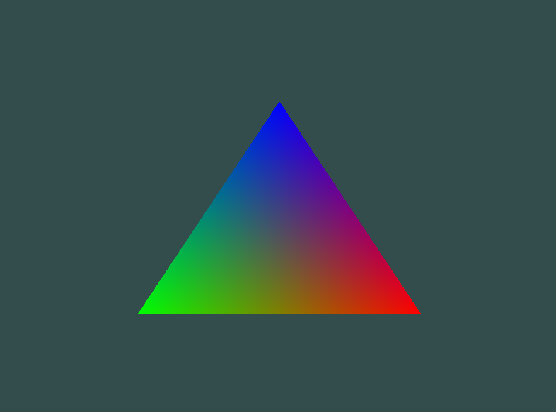

<!--
 * @Description:说明
 * @Author: Amamiya
 * @Date: 2022-04-23 14:25:56
 * TechChangeTheWorld
 * WHUROBOCON_Alright_Reserved
-->

# LearnOpenGL 记录

## Result



## Features

1. 添加了 README.md
2. 添加了新顶点属性——颜色
3. 添加了 result 图片

## Usage

```
mkdir build
cd build
cmake ..
make -j$(nproc)
```
